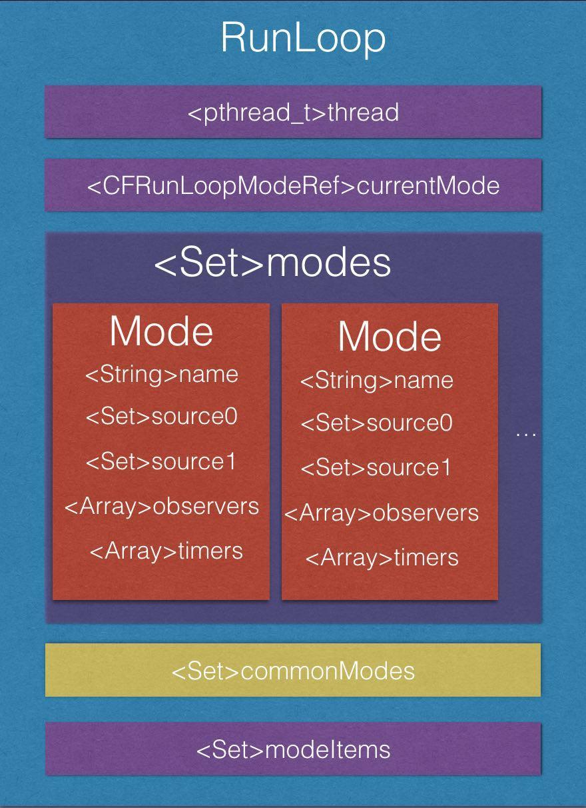
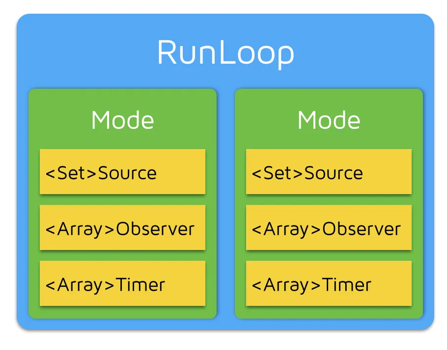
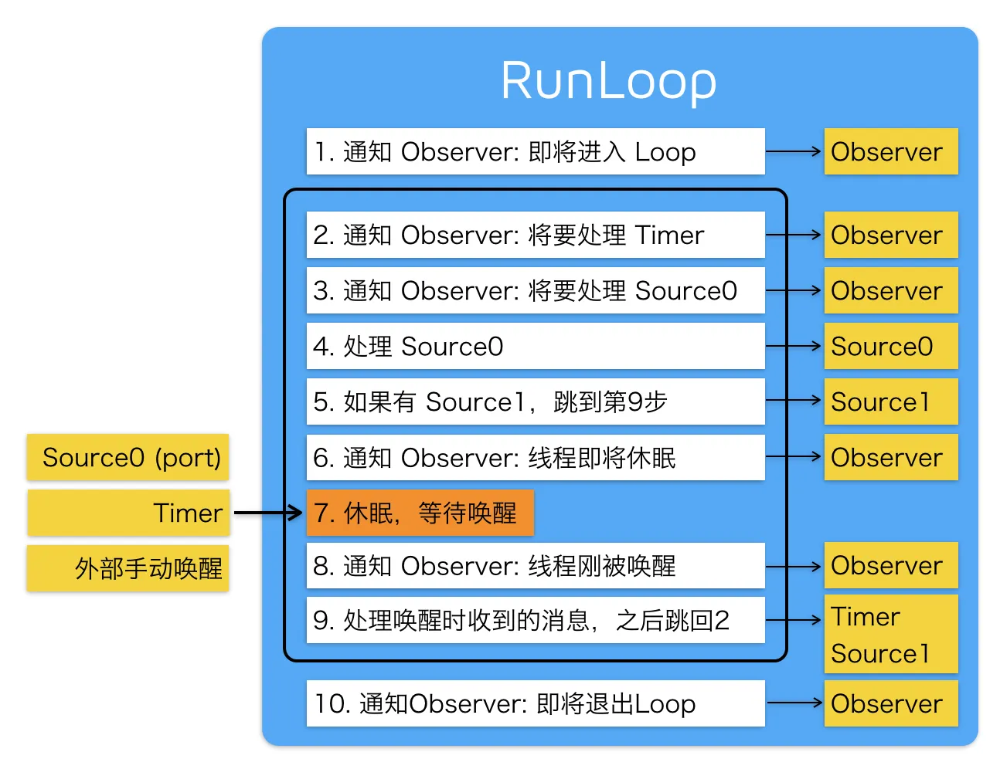

# Runloop



## RunLoop 的概念

一般来讲，一个线程一次只能执行一个任务，执行完成后线程就会退出。如果我们需要一个机制，让线程能随时处理事件但并不退出，通常的代码逻辑是这样的

```Swift
function loop() {
    initialize();
    do {
        var message = get_next_message();
        process_message(message);
    } while (message != quit);
}
```

这种模型通常被称作 Event Loop。 Event Loop 在很多系统和框架里都有实现，比如 Node.js的事件处理，比如 Windows 程序的消息循环，再比如 OSX/iOS 里的 RunLoop。实现这种模型的关键点在于：如何管理事件/消息，如何让线程在没有处理消息时休眠以避免资源占用、在有消息到来时立刻被唤醒。

所以，RunLoop 实际上就是一个对象，这个对象管理了其需要处理的事件和消息，并提供了一个入口函数来执行上面 Event Loop 的逻辑。线程执行了这个函数后，就会一直处于这个函数内部 “接受消息->等待->处理” 的循环中，直到这个循环结束（比如传入 quit` 的消息），函数返回。

OSX/iOS 系统中，提供了两个这样的对象：NSRunLoop 和 CFRunLoopRef。

CFRunLoopRef 是在 CoreFoundation 框架内的，它提供了纯 C 函数的 API，所有这些 API 都是线程安全的。

NSRunLoop 是基于 CFRunLoopRef 的封装，提供了面向对象的 API，但是这些 API 不是线程安全的。

CFRunLoopRef 的代码是开源的，你可以在这里 <http://opensource.apple.com/tarballs/CF/> 下载到整个 CoreFoundation 的源码来查看。

(Update: Swift 开源后，苹果又维护了一个跨平台的 CoreFoundation 版本：<https://github.com/apple/swift-corelibs-foundation/>，这个版本的源码可能和现有iOS系统中的实现略不一样，但更容易编译，而且已经适配了Linux/Windows。)

## RunLoop与线程的关系

iOS 开发中能遇到两个线程对象: pthread_t 和 NSThread, NSThread是 pthread_t 的封装, 你可以通过 pthread_main_thread_np() 或 [NSThread mainThread] 来获取主线程；也可以通过 pthread_self() 或 [NSThread currentThread] 来获取当前线程。CFRunLoop 是基于 pthread 来管理的。
苹果不允许直接创建 RunLoop，它只提供了两个自动获取的函数：CFRunLoopGetMain() 和 CFRunLoopGetCurrent()。 这两个函数内部的逻辑大概是下面这样:

```C
/// 全局的Dictionary，key 是 pthread_t， value 是 CFRunLoopRef
static CFMutableDictionaryRef loopsDic;
/// 访问 loopsDic 时的锁
static CFSpinLock_t loopsLock;
 
/// 获取一个 pthread 对应的 RunLoop。
CFRunLoopRef _CFRunLoopGet(pthread_t thread) {
    OSSpinLockLock(&loopsLock);
    
    if (!loopsDic) {
        // 第一次进入时，初始化全局Dic，并先为主线程创建一个 RunLoop。
        loopsDic = CFDictionaryCreateMutable();
        CFRunLoopRef mainLoop = _CFRunLoopCreate();
        CFDictionarySetValue(loopsDic, pthread_main_thread_np(), mainLoop);
    }
    
    /// 直接从 Dictionary 里获取。
    CFRunLoopRef loop = CFDictionaryGetValue(loopsDic, thread));
    
    if (!loop) {
        /// 取不到时，创建一个
        loop = _CFRunLoopCreate();
        CFDictionarySetValue(loopsDic, thread, loop);
        /// 注册一个回调，当线程销毁时，顺便也销毁其对应的 RunLoop。
        _CFSetTSD(..., thread, loop, __CFFinalizeRunLoop);
    }
    
    OSSpinLockUnLock(&loopsLock);
    return loop;
}
 
CFRunLoopRef CFRunLoopGetMain() {
    return _CFRunLoopGet(pthread_main_thread_np());
}
 
CFRunLoopRef CFRunLoopGetCurrent() {
    return _CFRunLoopGet(pthread_self());
}
```

从上面的代码可以看出，线程和RunLoop之间是一一对应的，其关系是保存在一个全局的 Dictionary 里。线程刚创建时并没有 RunLoop，如果你不主动获取，那它一直都不会有。RunLoop 的创建是发生在第一次获取时，RunLoop 的销毁是发生在线程结束时。你只能在一个线程的内部获取其 RunLoop（主线程除外）.

## RunLoop 对外的接口

在 CoreFoundation 里面关于 RunLoop 有5个类:

- CFRunLoopRef
- CFRunLoopModeRef
- CFRunLoopSourceRef
- CFRunLoopTimerRef
- CFRunLoopObserverRef

其中 CFRunLoopModeRef 类并没有对外暴露，只是通过 CFRunLoopRef 的接口进行了封装。他们的关系如下:

一个 RunLoop 包含若干个 Mode，每个 Mode 又包含若干个 Source/Timer/Observer。每次调用 RunLoop 的主函数时，只能指定其中一个 Mode，这个Mode被称作 CurrentMode。如果需要切换 Mode，只能退出 Loop，再重新指定一个 Mode 进入。这样做主要是为了分隔开不同组的 Source/Timer/Observer，让其互不影响。
**CFRunLoopSourceRef** 是事件产生的地方。Source有两个版本：Source0 和 Source1。

- Source0 只包含了一个回调（函数指针），它并不能主动触发事件。使用时，你需要先调用 CFRunLoopSourceSignal(source)，将这个 Source 标记为待处理，然后手动调用 CFRunLoopWakeUp(runloop) 来唤醒 RunLoop，让其处理这个事件。
- Source1 包含了一个 mach_port 和一个回调（函数指针），被用于通过内核和其他线程相互发送消息。这种 Source 能主动唤醒 RunLoop 的线程，其原理在下面会讲到。

**CFRunLoopTimerRef**是基于时间的触发器，它和 NSTimer 是toll-free bridged 的，可以混用。其包含一个时间长度和一个回调（函数指针）。当其加入到 RunLoop 时，RunLoop会注册对应的时间点，当时间点到时，RunLoop会被唤醒以执行那个回调。
**CFRunLoopObserverRef**是观察者，每个 Observer 都包含了一个回调（函数指针），当 RunLoop 的状态发生变化时，观察者就能通过回调接受到这个变化。可以观测的时间点有以下几个：

```C
typedef CF_OPTIONS(CFOptionFlags, CFRunLoopActivity) {
    kCFRunLoopEntry         = (1UL << 0), // 即将进入Loop
    kCFRunLoopBeforeTimers  = (1UL << 1), // 即将处理 Timer
    kCFRunLoopBeforeSources = (1UL << 2), // 即将处理 Source
    kCFRunLoopBeforeWaiting = (1UL << 5), // 即将进入休眠
    kCFRunLoopAfterWaiting  = (1UL << 6), // 刚从休眠中唤醒
    kCFRunLoopExit          = (1UL << 7), // 即将退出Loop
};
```

>上面的 Source/Timer/Observer 被统称为 __mode item__，一个 item 可以被同时加入多个mode。但一个 item 被重复加入同一个 mode 时是不会有效果的。如果一个 mode 中一个 item 都没有，则 RunLoop 会直接退出，不进入循环。

## RunLoop 的 Mode

CFRunLoopMode 和 CFRunLoop 的结构大致如下：

```C
struct __CFRunLoopMode {
    CFStringRef _name;            // Mode Name, 例如 @"kCFRunLoopDefaultMode"
    CFMutableSetRef _sources0;    // Set
    CFMutableSetRef _sources1;    // Set
    CFMutableArrayRef _observers; // Array
    CFMutableArrayRef _timers;    // Array
    ...
};
 
struct __CFRunLoop {
    CFMutableSetRef _commonModes;     // Set
    CFMutableSetRef _commonModeItems; // Set<Source/Observer/Timer>
    CFRunLoopModeRef _currentMode;    // Current Runloop Mode
    CFMutableSetRef _modes;           // Set
    ...
};
```

这里有个概念叫 “CommonModes”：一个 Mode 可以将自己标记为”Common”属性（通过将其 ModeName 添加到 RunLoop 的 “commonModes” 中）。每当 RunLoop 的内容发生变化时，RunLoop 都会自动将 _commonModeItems 里的 Source/Observer/Timer同步到具有 “Common” 标记的所有Mode里。

应用场景举例：主线程的 RunLoop 里有两个预置的 Mode：kCFRunLoopDefaultMode 和 UITrackingRunLoopMode。这两个 Mode 都已经被标记为”Common”属性。DefaultMode 是 App 平时所处的状态，TrackingRunLoopMode 是追踪 ScrollView滑动时的状态。当你创建一个Timer并加到 DefaultMode 时，Timer 会得到重复回调，但此时滑动一个TableView时，RunLoop 会将 mode 切换为 TrackingRunLoopMode，这时 Timer 就不会被回调。一种办法就是将这个 Timer 分别加入这两个 Mode。还有一种方式，就是将 Timer 加入到顶层的 RunLoop 的 “commonModeItems” 中。”commonModeItems” 被 RunLoop 自动更新到所有具有”Common”属性的 Mode 里去。

>系统默认注册了5个Mode:
>kCFRunLoopDefaultMode: App的默认 Mode，通常主线程是在这个 Mode 下运行的。
>UITrackingRunLoopMode: 界面跟踪 Mode，用于 ScrollView 追踪触摸滑动，保证界面滑动时不受其他 Mode 影响。
>UIInitializationRunLoopMode: 在刚启动 App 时第进入的第一个 Mode，启动完成后就不再使用。
>GSEventReceiveRunLoopMode: 接受系统事件的内部 Mode，通常用不到。
>kCFRunLoopCommonModes: 这是一个占位的 Mode，没有实际作用。

## RunLoop的内部逻辑



### Runloop的实现

```C
/// 用DefaultMode启动
void CFRunLoopRun(void) {
    CFRunLoopRunSpecific(CFRunLoopGetCurrent(), kCFRunLoopDefaultMode, 1.0e10, false);
}
 
/// 用指定的Mode启动，允许设置RunLoop超时时间
int CFRunLoopRunInMode(CFStringRef modeName, CFTimeInterval seconds, Boolean stopAfterHandle) {
    return CFRunLoopRunSpecific(CFRunLoopGetCurrent(), modeName, seconds, returnAfterSourceHandled);
}
 
/// RunLoop的实现
int CFRunLoopRunSpecific(runloop, modeName, seconds, stopAfterHandle) {
    
    /// 首先根据modeName找到对应mode
    CFRunLoopModeRef currentMode = __CFRunLoopFindMode(runloop, modeName, false);
    /// 如果mode里没有source/timer/observer, 直接返回。
    if (__CFRunLoopModeIsEmpty(currentMode)) return;
    
    /// 1. 通知 Observers: RunLoop 即将进入 loop。
    __CFRunLoopDoObservers(runloop, currentMode, kCFRunLoopEntry);
    
    /// 内部函数，进入loop
    __CFRunLoopRun(runloop, currentMode, seconds, returnAfterSourceHandled) {
        
        Boolean sourceHandledThisLoop = NO;
        int retVal = 0;
        do {
 
            /// 2. 通知 Observers: RunLoop 即将触发 Timer 回调。
            __CFRunLoopDoObservers(runloop, currentMode, kCFRunLoopBeforeTimers);
            /// 3. 通知 Observers: RunLoop 即将触发 Source0 (非port) 回调。
            __CFRunLoopDoObservers(runloop, currentMode, kCFRunLoopBeforeSources);
            /// 执行被加入的block
            __CFRunLoopDoBlocks(runloop, currentMode);
            
            /// 4. RunLoop 触发 Source0 (非port) 回调。
            sourceHandledThisLoop = __CFRunLoopDoSources0(runloop, currentMode, stopAfterHandle);
            /// 执行被加入的block
            __CFRunLoopDoBlocks(runloop, currentMode);
 
            /// 5. 如果有 Source1 (基于port) 处于 ready 状态，直接处理这个 Source1 然后跳转去处理消息。
            if (__Source0DidDispatchPortLastTime) {
                Boolean hasMsg = __CFRunLoopServiceMachPort(dispatchPort, &msg)
                if (hasMsg) goto handle_msg;
            }
            
            /// 通知 Observers: RunLoop 的线程即将进入休眠(sleep)。
            if (!sourceHandledThisLoop) {
                __CFRunLoopDoObservers(runloop, currentMode, kCFRunLoopBeforeWaiting);
            }
            
            /// 7. 调用 mach_msg 等待接受 mach_port 的消息。线程将进入休眠, 直到被下面某一个事件唤醒。
            /// • 一个基于 port 的Source 的事件。
            /// • 一个 Timer 到时间了
            /// • RunLoop 自身的超时时间到了
            /// • 被其他什么调用者手动唤醒
            __CFRunLoopServiceMachPort(waitSet, &msg, sizeof(msg_buffer), &livePort) {
                mach_msg(msg, MACH_RCV_MSG, port); // thread wait for receive msg
            }
 
            /// 8. 通知 Observers: RunLoop 的线程刚刚被唤醒了。
            __CFRunLoopDoObservers(runloop, currentMode, kCFRunLoopAfterWaiting);
            
            /// 收到消息，处理消息。
            handle_msg:
 
            /// 9.1 如果一个 Timer 到时间了，触发这个Timer的回调。
            if (msg_is_timer) {
                __CFRunLoopDoTimers(runloop, currentMode, mach_absolute_time())
            } 
 
            /// 9.2 如果有dispatch到main_queue的block，执行block。
            else if (msg_is_dispatch) {
                __CFRUNLOOP_IS_SERVICING_THE_MAIN_DISPATCH_QUEUE__(msg);
            } 
 
            /// 9.3 如果一个 Source1 (基于port) 发出事件了，处理这个事件
            else {
                CFRunLoopSourceRef source1 = __CFRunLoopModeFindSourceForMachPort(runloop, currentMode, livePort);
                sourceHandledThisLoop = __CFRunLoopDoSource1(runloop, currentMode, source1, msg);
                if (sourceHandledThisLoop) {
                    mach_msg(reply, MACH_SEND_MSG, reply);
                }
            }
            
            /// 执行加入到Loop的block
            __CFRunLoopDoBlocks(runloop, currentMode);
            
 
            if (sourceHandledThisLoop && stopAfterHandle) {
                /// 进入loop时参数说处理完事件就返回。
                retVal = kCFRunLoopRunHandledSource;
            } else if (timeout) {
                /// 超出传入参数标记的超时时间了
                retVal = kCFRunLoopRunTimedOut;
            } else if (__CFRunLoopIsStopped(runloop)) {
                /// 被外部调用者强制停止了
                retVal = kCFRunLoopRunStopped;
            } else if (__CFRunLoopModeIsEmpty(runloop, currentMode)) {
                /// source/timer/observer一个都没有了
                retVal = kCFRunLoopRunFinished;
            }
            
            /// 如果没超时，mode里没空，loop也没被停止，那继续loop。
        } while (retVal == 0);
    }
    
    /// 10. 通知 Observers: RunLoop 即将退出。
    __CFRunLoopDoObservers(rl, currentMode, kCFRunLoopExit);
}
```

### AutoreleasePool

App启动后，苹果在主线程 RunLoop 里注册了两个 Observer，其回调都是 _wrapRunLoopWithAutoreleasePoolHandler()。

第一个 Observer 监视的事件是 Entry(即将进入Loop)，其回调内会调用 _objc_autoreleasePoolPush() 创建自动释放池。其 order 是-2147483647，优先级最高，保证创建释放池发生在其他所有回调之前。

第二个 Observer 监视了两个事件： BeforeWaiting(准备进入休眠) 时调用_objc_autoreleasePoolPop() 和 _objc_autoreleasePoolPush() 释放旧的池并创建新池；Exit(即将退出Loop) 时调用 _objc_autoreleasePoolPop() 来释放自动释放池。这个 Observer 的 order 是 2147483647，优先级最低，保证其释放池子发生在其他所有回调之后。

在主线程执行的代码，通常是写在诸如事件回调、Timer回调内的。这些回调会被 RunLoop 创建好的 AutoreleasePool 环绕着，所以不会出现内存泄漏，开发者也不必显示创建 Pool 了。

### 事件响应

苹果注册了一个 Source1 (基于 mach port 的) 用来接收系统事件，其回调函数为 __IOHIDEventSystemClientQueueCallback()。

当一个硬件事件(触摸/锁屏/摇晃等)发生后，首先由 IOKit.framework 生成一个 IOHIDEvent 事件并由 SpringBoard 接收。SpringBoard 只接收按键(锁屏/静音等)，触摸，加速，接近传感器等几种 Event，随后用 mach port 转发给需要的App进程。随后苹果注册的那个 Source1 就会触发回调，并调用 _UIApplicationHandleEventQueue() 进行应用内部的分发。

_UIApplicationHandleEventQueue() 会把 IOHIDEvent 处理并包装成 UIEvent 进行处理或分发，其中包括识别 UIGesture/处理屏幕旋转/发送给 UIWindow 等。通常事件比如 UIButton 点击、touchesBegin/Move/End/Cancel 事件都是在这个回调中完成的。

### 手势识别

当上面的 _UIApplicationHandleEventQueue() 识别了一个手势时，其首先会调用 Cancel 将当前的 touchesBegin/Move/End 系列回调打断。随后系统将对应的 UIGestureRecognizer 标记为待处理。

苹果注册了一个 Observer 监测 BeforeWaiting (Loop即将进入休眠) 事件，这个Observer的回调函数是 _UIGestureRecognizerUpdateObserver()，其内部会获取所有刚被标记为待处理的 GestureRecognizer，并执行GestureRecognizer的回调。

当有 UIGestureRecognizer 的变化(创建/销毁/状态改变)时，这个回调都会进行相应处理。

### 界面更新

当在操作 UI 时，比如改变了 Frame、更新了 UIView/CALayer 的层次时，或者手动调用了 UIView/CALayer 的 setNeedsLayout/setNeedsDisplay方法后，这个 UIView/CALayer 就被标记为待处理，并被提交到一个全局的容器去。

苹果注册了一个 Observer 监听 BeforeWaiting(即将进入休眠) 和 Exit (即将退出Loop) 事件，回调去执行一个很长的函数： _ZN2CA11Transaction17observer_callbackEP19__CFRunLoopObservermPv()。这个函数里会遍历所有待处理的 UIView/CAlayer 以执行实际的绘制和调整，并更新 UI 界面。

### AsyncDisplayKit

[AsyncDisplayKit](https://github.com/facebook/AsyncDisplayKit)是 Facebook 推出的用于保持界面流畅性的框架，其原理大致如下：
UI 线程中一旦出现繁重的任务就会导致界面卡顿，这类任务通常分为3类：排版，绘制，UI对象操作。

排版通常包括计算视图大小、计算文本高度、重新计算子式图的排版等操作。 绘制一般有文本绘制 (例如 CoreText)、图片绘制 (例如预先解压)、元素绘制 (Quartz)等操作。 UI对象操作通常包括 UIView/CALayer 等 UI 对象的创建、设置属性和销毁。

其中前两类操作可以通过各种方法扔到后台线程执行，而最后一类操作只能在主线程完成，并且有时后面的操作需要依赖前面操作的结果 （例如TextView创建时可能需要提前计算出文本的大小）。ASDK 所做的，就是尽量将能放入后台的任务放入后台，不能的则尽量推迟 (例如视图的创建、属性的调整)。

为此，ASDK 创建了一个名为 ASDisplayNode 的对象，并在内部封装了 UIView/CALayer，它具有和 UIView/CALayer 相似的属性，例如 frame、backgroundColor等。所有这些属性都可以在后台线程更改，开发者可以只通过 Node 来操作其内部的 UIView/CALayer，这样就可以将排版和绘制放入了后台线程。但是无论怎么操作，这些属性总需要在某个时刻同步到主线程的 UIView/CALayer 去。

ASDK 仿照 QuartzCore/UIKit 框架的模式，实现了一套类似的界面更新的机制：即在主线程的 RunLoop 中添加一个 Observer，监听了 kCFRunLoopBeforeWaiting 和 kCFRunLoopExit 事件，在收到回调时，遍历所有之前放入队列的待处理的任务，然后一一执行。 具体的代码可以看这里：[ASAsyncTransactionGroup](https://github.com/facebookarchive/AsyncDisplayKit/blob/master/Source/Details/Transactions/_ASAsyncTransactionGroup.m).
